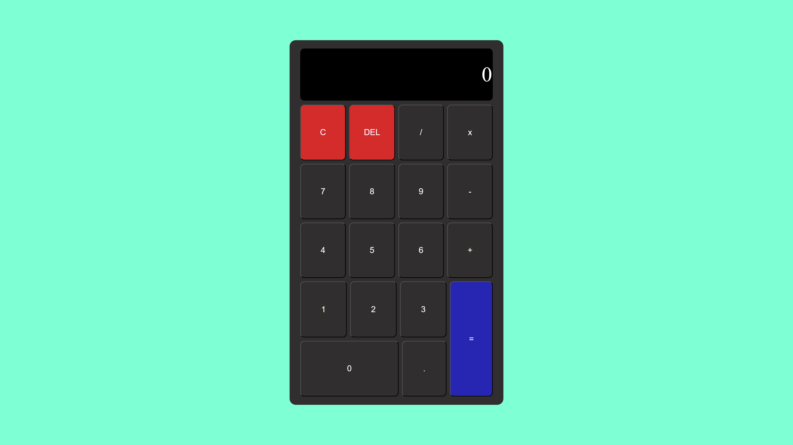

# Calculator

A browser-based Calculator project, built as part of The Odin Project online course (https://www.theodinproject.com/lessons/foundations-landing-page). Perform basic arithmetic operations with a simple and intuitive interface. Keyboard input is also supported. 

---

## Built it using:
- HTML  
- CSS  
- Flexbox  
- JavaScript  

---

## What I learned:
- Creating a functional calculator interface using HTML and CSS  
- Implementing arithmetic operations in JavaScript (`add`, `subtract`, `multiply`, `divide`)  
- Building a general `operate` function to handle any operator and two numbers  
- Handling user input with buttons and **keyboard support** 
- Managing edge cases:
  - Preventing evaluation without two numbers and an operator  
  - Handling consecutive operator presses  
  - Rounding long decimals for display  
  - Preventing division by zero  
- Updating the display dynamically  
- Adding extra features: decimal input, clear button, and optional backspace  
- Event handling for buttons and keyboard input  
- Using Git/GitHub for version control  

> Keyboard support works smoothly and is fully implemented. 

---

## Screenshots

  

---

## How to use:
1. Clone the repository: `git clone git@github.com:yourusername/Calculator.git`  
2. Open `index.html` in your browser.  
3. Use the on-screen buttons to perform calculations.  
4. Keyboard input also works, though the main focus is the on-screen buttons.  
5. Press the clear button to reset the display.  

---

## License
This project is licensed under the MIT License - see the [LICENSE](./LICENSE) file